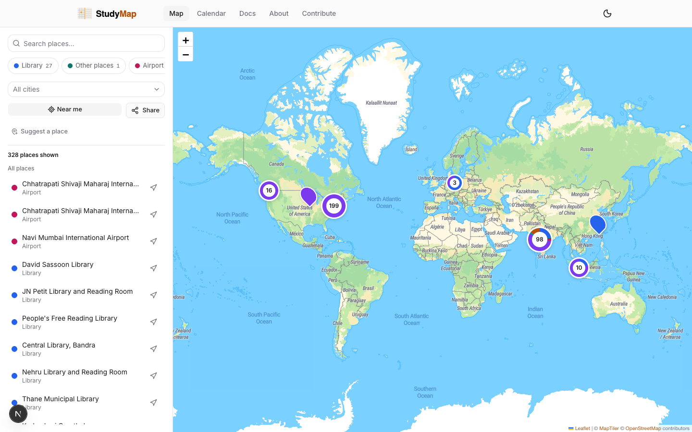
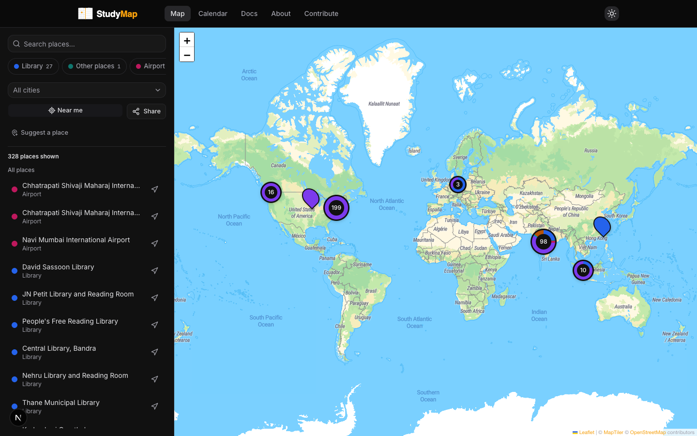
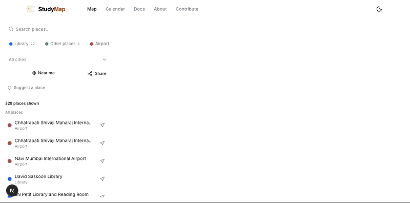
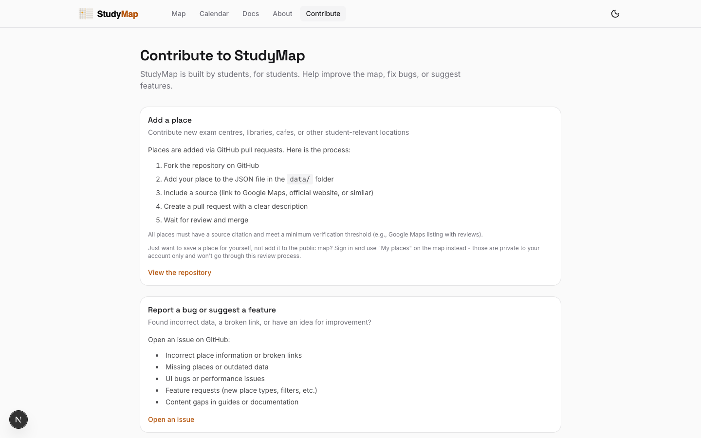
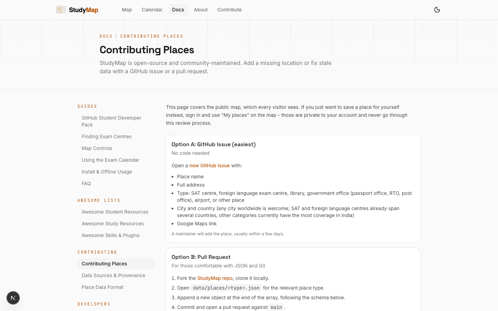

# StudyMap

A crowdsourced map of student-important places across the Mumbai Metropolitan Region (Mumbai, Thane, Navi Mumbai). Open source, zero setup, free forever.

**Live:** [studyymap.com](https://studyymap.com)  

---

## See it in action

StudyMap puts student-relevant places on one searchable, filterable map.



<details>
<summary>View the dark theme</summary>



</details>

Search for a place, filter by category, and open a result to focus the map:



## What it does

- **Places map**: find libraries, SAT centres, foreign language exam centres, government offices, airports, and other student-relevant places. Filter by type and city. SAT and foreign language centres already span several countries; other categories currently have the most coverage in India.
- **Contribute**: add places or fix data via a GitHub pull request or issue, or the in-app "Suggest a place" button on the map - no account needed either way.
- **Docs**: guides covering the map, calendar, contributing, self-hosting, and more at [/docs](https://studyymap.com/docs).
- **Legal**: privacy policy, terms of service, and data disclaimer for the crowdsourced dataset.

## Quick start

```bash
npm install
npm run dev
```

Open http://localhost:3000. No environment variables needed; the map reads place data via `studymap.config.ts`, which imports it from `data/places/`.

## Data schema

Places live in `data/places/<type>.json`, one file per category. The record shape,
valid types, and per-field rules are documented once in
[`data/CONTRIBUTING.md`](data/CONTRIBUTING.md) and enforced by
[`data/places.schema.json`](data/places.schema.json) via `npm run validate` -
that pair is the source of truth, not this README.

## How to add a place

1. Fork this repo
2. Add your place to the correct `data/places/<type>.json`
3. Verify `lat`/`lng` against Google Maps
4. Set `gmaps_link` to the Google Maps link
5. Open a pull request with a description of the place and a source

See [CONTRIBUTING.md](CONTRIBUTING.md) for full guidelines.

### Contribution flow

The in-app contribution page explains the place-data workflow, while the docs
cover the issue-based path for proposing additions and corrections.





## Architecture

The folder layout, data flow, and key modules are documented once in
[ARCHITECTURE.md](ARCHITECTURE.md) (also rendered live at
[/docs/architecture](https://studyymap.com/docs/architecture)) - not duplicated here, so this
README can't drift from the real thing the way its old copy of the folder tree did.

## Tech stack

- **Next.js 16** (App Router)
- **Leaflet + react-leaflet** (interactive map, marker clustering)
- **Supabase** (optional sign-in, gates saved places + personal calendar events)
- **shadcn/ui + Tailwind v4** (UI components)
- **next-themes** (dark/light mode)

## Running your own fork

Want StudyMap for a different city? Click "Use this template" above, then follow
[SELF-HOSTING.md](SELF-HOSTING.md) (also at [/docs/self-hosting](https://studyymap.com/docs/self-hosting)):
set your region and dataset in one config file, optionally wire up your own Supabase project for
sign-in, and deploy.

## Contributing

See [CONTRIBUTING.md](CONTRIBUTING.md).

## Good first issues

New here? Start with an issue tagged [`good first issue`](https://github.com/StudentSuite/StudyMap/issues?q=is%3Aissue+is%3Aopen+label%3A%22good+first+issue%22) or browse everything tagged [`help wanted`](https://github.com/StudentSuite/StudyMap/issues?q=is%3Aissue+is%3Aopen+label%3A%22help+wanted%22). Adding a place from your own neighbourhood ([#18](https://github.com/StudentSuite/StudyMap/issues/18)) needs no coding at all.

## Contributors

Thanks to everyone who has added a place, fixed the map, or improved the docs.

[](https://github.com/StudentSuite/StudyMap/graphs/contributors)

## License

MIT. See [LICENSE](LICENSE).
